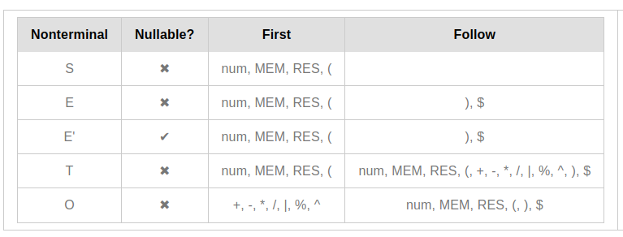
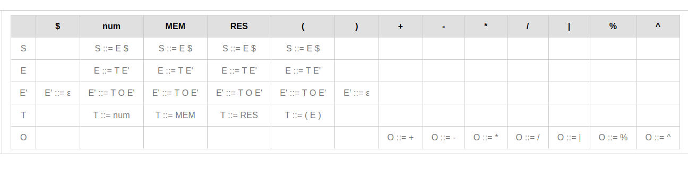
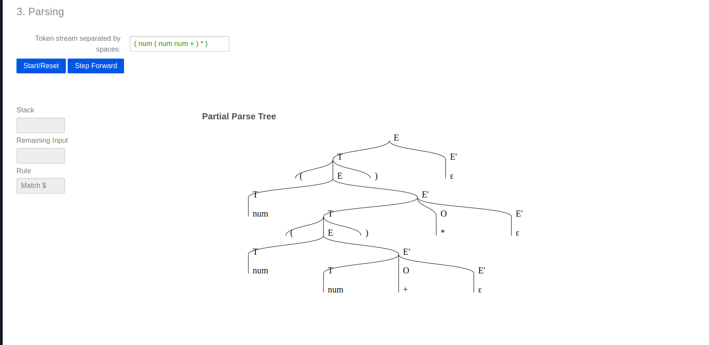

# Project Name

## Description

This project is about a program capable of opening a file text, containing expressions and simple statements, with an expression by line and create the lexicon and syntactic analyzers.
The program you will developed reads the code in an input.txt file and generate a tokens string and the abstract syntactic tree regarding each of the code texts.

## Rules

The following shows the rules that the program must follow to generate the tokens and the abstract syntactic tree.

E ::= T E'
E' ::= T O E'
E' ::= ''
T ::= num
T ::= MEM
T ::= RES
T ::= ( E )
O ::= +
O ::= -
O ::= \*
O ::= /
O ::= |
O ::= %
O ::= ^

### First and Follow

### Predictive Table

### Syntatic Tree Example

## License

This project is licensed under the [MIT License](LICENSE).
